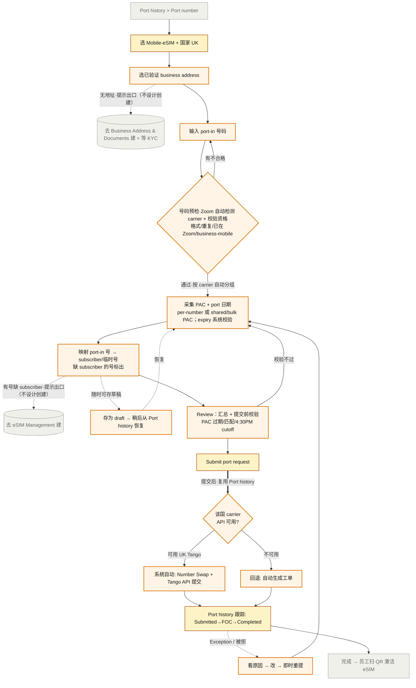

<!--
 Living Onepage 内部说明（agent 用，designer 不需要读）。

Phase-group layout:
- 本文件由 /ux-project:start 生成空 stub，每个 phase 增量填充各自的区块；agent 永不自动改 prior phase 内容（rule 25）。
- Phase 1 填：PRD 一句话总结、Final Goal、Problem Framing、PM ask vs Interpreted、Target Users、User Behaviors、用户场景、Scenario Map（§14）
- Phase 2 填：JTBD（§6）、Constraints、Decisions、Assumptions、Open Questions、Design Direction、Not Doing（§15）
- Phase 3 填：Handoff Notes、IA、Interaction Flow

Cite 信息:
- 本文件 body 绝**不**出现 `[ref: ...]` / `[^d<n>]` / `[^a<n>]` 这类 designer 可见的 ref 标记。Onepage 是给设计师/评审看的产物，干净 prose 即可。
- Agent 在 reasoning 时**内部**知道每条 claim 的来源（PRD / KB / memory）—— 通过 conversation context 维持，不持久化到本文件。
- Phase 3 confirm gate 时跑 cite-check：agent 重新对照每条 substantive claim 与 PRD / KB / memory，作为一张 claim ↔ source 表呈给设计师逐条 approve；approve 通过的 source 写到 decisions.md / assumptions.md（已有文件，带内部 D / A id）—— 不进 onepage。
- 没找到 source 的 claim → 设计师选：补 source / 改为 assumption / 删除。

Stale 处理:
- 全文级 stale / stale_reason 字段已**移除**。
- 改为 state.md frontmatter 的 stale_phase_1 / stale_phase_2 / stale_phase_3 三个 boolean。
- /ux-project:add-context 命中影响 phase 时 set 对应 stale_phase_N=true，由设计师在下次 /ux-project:refine 决定是否 re-walk。

HTML companion:
- /ux-project:export-html 渲染本文件为 ux-onepage.html，要求 phase_3_confirmed_at != null。
- HTML 同样不展示任何 ref 信息。
-->

# UX Onepage: porting-automation-tango-tmo

## Phase 1: 用户与问题

### PRD 一句话总结

现状：Zoom Phone 号码 porting 只支持 Local/Toll-free 自助导入，eSIM 号码只能走人工工单/门户，量一大就压垮支持团队。本项目在现有 Port number 入口下新增 eSIM 号码类型：复用 business address/KYC 采集、再补 porting 专属信息（如 PAC code），打通 carrier porting API 自动提交并回传状态，让 admin 自助完成跨国 eSIM porting 并跟踪到结果，省去工单往返。

### 1. Final Goal

让企业 admin 在现有 Port number 入口里自助完成 eSIM 号码的跨国 porting（先 UK Tango、US 随后），复用已采集的 business address，并能全程跟踪每个号码的 porting 结果——无需再走人工工单。

### 2. Problem Framing

真正要解决的不是"接一个 carrier API"，而是把今天分散在工单/手动门户里的 eSIM porting 收束成一条 admin 可自助、可跟踪的流程：统一前置采集（复用 business address + 补 PAC 等 porting 专属信息），再按国家/carrier 决定自动提交还是回退工单。PM 把 ask 表述成"接 Tango/TMO API 自动化"，但 API 只是执行末端；用户体验的重心在采集的统一性和状态的可见性。

### 3. PM Original Ask vs. Interpreted User Need

| PM Original Ask | Interpreted User Need |
|---|---|
| 接 Tango/TMO carrier porting API 自动化 porting | admin 能在一条流程里自助走完 eSIM porting（含必需的 subscriber 前置）并跟踪到结果 |
| 复用 business address（像 get-number flow） | 已验证 address 直接选用；未建则引导去建（KYC 异步，不内联新建） |
| 扩展到所有国家、替代工单 | 统一采集流程；有 carrier API 走 API、无则回退工单 |

### 4. Target Users

#### Primary
企业 admin（兼管通信/ops）—— 要把公司号码迁到 Zoom Phone Mobile，自助完成、不开工单。

#### Secondary
porting team —— 现状的手动执行者（Tango 门户 number swap + 提交）；API 自动化后角色从"手动操作"转为"异常兜底"。

#### Impacted (non-direct)
持号员工(end user) —— 号码迁移但 eSIM 不变，port 完成后需扫 QR 激活；KYC team —— 审核 business address，是 porting 前的异步闸。

### 5. User Behaviors

#### Current（线上现状）
eSIM porting 今天无自助：admin 要在门户里分头走 KYC → 取临时号 → eSIM Management 建 subscriber，然后提工单，由 porting team 在 Tango 门户手动 number swap + 提交；状态靠人工问。

#### Desired
在 Port number 一条流程里走完：选类型/国家 → 选 business address →（每号）建 subscriber（user+package+临时号）→ 采集 PAC/号码/日期 → 提交；系统自动 swap + API 提交，Port history 全程跟踪。

#### Failure
PAC 错/过期/不匹配被拒（标原因、即时重提）；business address 未验证或 KYC 未过（卡前置）；carrier API 不可用（回退工单）。

#### Edge
bulk PAC 一码多号；号码来自多个 donor（拆请求）；subscriber 之前已建好（无需重建）；eSIM 未激活（不影响 port 完成）。

### 用户场景

> Phase 1 起步先列 1 个最典型的用户场景，让我们对齐"这个功能可能在解决什么"。这是探索性描述，不是 JTBD —— JTBD 要经过 Phase 1/2 讨论分析后才能产出（见 Phase 2 中的 JTBD 区）。

#### 把公司一批英国 business mobile 号码搬到 Zoom

**用户**：英国一家中型公司的 IT admin（兼管通信），手上有约 40 个员工的 business mobile 号码，分散在原运营商。

**场景**：公司决定统一迁到 Zoom Phone Mobile（eSIM），admin 要把这 40 个现有号码 port 进来、而不是发新号。过去这种 eSIM porting Zoom 不支持自助，只能提工单等支持团队手动在 Tango 门户操作。

**新流程怎么用**：admin 进 Phone numbers > Port number，选号码类型 Mobile-eSIM + 国家 UK。系统检查该国 business address：已验证就直接选用，没有就引导去先建（KYC 异步审核，得等通过）。接着是这次理清的关键一段——每个要 port 的号码，背后都得先在 Tango 里有一个 subscriber（绑定某个 user + 服务 package + 一个占位临时号），port 才能提交。所以 admin 要为这 40 个号各自指定用户和套餐、系统从号池取临时号把 subscriber 建好并同步 Tango。然后填每个号的 PAC code（向原运营商 EE 要的、30 天有效）、确认待转号码、选 port 日期，bulk PAC 可批量。提交后系统替 admin 做 Number Swap、经 Tango API 提交 port-in；admin 在 Port history 看每号 Submitted → Port scheduled → Completed，被拒标原因、改了即时重提。等 port 完成，员工再扫之前邮件里的 eSIM QR 激活——eSIM 装没装不影响 port，只是最终用号要装。

**产品价值**：admin 在一条流程里自助跑完批量 eSIM porting（含必需的 subscriber 前置），不用开工单、不用等支持团队手动操作，全程知道每个号码到哪一步、出问题怎么修。

### 14. 用户场景全集与取舍

本项目为 iteration（在现有 Port number 流程上加 eSIM）。"是否要做" 列在 Phase 2 收敛后填；"类型" 列标 ★新增 / 改造 / 复用。

| # | 用户场景 | 来源视角 | 对用户价值 | 实现成本 | 是否核心 | 是否要做 | 类型 |
|---|---|---|---|---|---|---|---|
| S1 | 无匹配 business address：porting 内检测到该国无已验证地址，引导用户跳出去 Business Address & Documents 创建（KYC 异步审核，不做内联新建） | 首次时机 / 跨流程 / 出错预防 | 高 | 中 | 核心 | 要做 | ★新增 |
| S2 | 有已验证 business address：用户在 porting 内直接选择并应用，不重传文档直接采集 | 主路径 | 高 | 中 | 核心 | 要做 | ★新增 |
| S3 | 批量 port：一个 bulk PAC、20+ 号码分批提交 | 大客户时机 / 边界 | 高 | 中 | 核心 | 要做 | ★新增 |
| S4 | 待转号码来自多个原运营商（donor），自动按 donor 拆成多个 port 请求 | 边界 / 跨场景 | 中 | 低 | 边缘 | 要做（并入采集） | 复用 |
| S5 | port 被拒后修正重提（PAC 错/过期/号码不匹配，标原因即时重提） | 出错恢复 | 高 | 中 | 核心 | 要做 | 改造 |
| S6 | 全程跟踪每个号码状态（Port history: Submitted→Scheduled→Completed） | 提交后时机 | 高 | 中 | 核心 | 要做 | 改造 |
| S7 | cutover 出问题兜底：号码在原网停了但 Zoom 还没激活 | 出错恢复 / 边界 | 中 | 高 | 边缘 | 不做 | ★新增 |
| S8 | carrier API 不可用的国家→同一采集流程末端回退工单 | 跨场景 / 跨国 | 高 | 中 | 核心 | 要做 | ★新增 |
| S9 | US/TMO porting：套 UK 采集+提交骨架，carrier 差异 TBD | 跨国 persona | 高 | 高 | 核心(后置) | 要做（UK 先 / US 待 PM） | ★新增 |
| S10 | PAC 即将过期的校验/提醒（30 天有效，提交前校验） | 边界 / 出错预防 | 中 | 低 | 边缘 | 要做 | ★新增 |
| S11 | eSIM 不变、只换号码——员工(end user) 视角的感知 | persona 切换 | 低 | 低 | 不在范围 | 不做 | 复用 |
| S12 | 取消进行中的 port 请求（baseline 有 Canceled 状态） | 边界 | 中 | 中 | 边缘 | 不做 | 复用 |
| S13 | subscriber 前置：porting 内关联已建 subscriber（带临时号）；未建则引导去 eSIM Management 建（选 user+package+取号） | 前置时机 / 跨流程 | 高 | 高 | 核心 | 要做（前置门槛，D3） | ★新增 |
| S14 | 保存草稿：采集途中（缺 subscriber/地址、或想稍后继续）存为 draft，later re-visit 接着填 | 中断 / 恢复 | 中 | 中 | 核心 | 要做 | ★新增 |

**类型释义**（iteration / refactor 项目专用）:
- **★新增**: 之前不存在的场景，整个流程都是新加的
- **改造**: 之前有类似场景，本次修改了流程 / 增加分支 / 改变行为
- **复用**: 之前已支持，本次不动；列出来是为了让评审看到全局上下文

## Phase 2: 取舍与约束

### 6. JTBD

> Phase 1+2 讨论后从 KEEP 场景沉淀出来的 user jobs。Primary 是核心驱动需求；Secondary 是细化/辅助；Anti-JTBD 是用户明确不想要的状态。

#### Primary
- JTBD-1：当我（admin）要把公司一批 UK 员工的 business mobile 号码迁到 Zoom，我想在现有 porting 入口里选好已有 business address、把每个真号关联到对应 subscriber、填一次 porting 信息就提交，从而不开工单完成迁移。
- JTBD-2：当我提交了一批 port 请求，我想看到每个号码的实时状态（提交 / 已排期 / 完成 / 异常），从而掌握进度、不用追着支持团队问。
- JTBD-3：当某个号码被拒（PAC 错 / 过期 / 不匹配），我想清楚看到原因并就地改、即时重提，从而自己解决不必求助。
- JTBD-4：当我有大批号码（同一 bulk PAC），我想一次批量填、分批提交，从而高效处理几十上百个号。

#### Secondary
- JTBD-5：当我要 port 的国家还没建 business address，我想被清楚引导去先建（并知道要等 KYC），从而不卡在"为什么不能继续"。
- JTBD-6：当我的号码来自多个原运营商，我想系统自动按运营商拆请求，从而不用自己搞清楚怎么分。
- JTBD-7：当我填的 PAC 快过期，我想在提交前被提醒，从而避免可预见的被拒。
- JTBD-8：当某国还没接 carrier API，我想用同一套采集流程提交、由系统转工单，从而体验一致、不用另走老路。
- JTBD-9：当某个待 port 号还没有对应的 subscriber，我想被清楚引导去 eSIM Management 先建（选 user+package+取号），从而满足 port 的前提、知道为什么不能直接 port。
- JTBD-10：当我中途缺前置（subscriber/地址）或想稍后再继续，我想把当前 porting 进度存成草稿、回头接着填，从而不丢已填内容。

#### Anti-JTBD
- 不想要：为了 port 在多个分散页面 / 工单系统之间拼凑流程。
- 不想要：提交后状态黑盒，只能等邮件或问支持。
- 不想要：被拒了不知道原因、不知道怎么改。

### 8. Constraints from KB and project memory

| Constraint | Confidence |
|---|---|
| business address + KYC 是 porting 前置，且 KYC 异步审核（Pending→Verified，自动生成工单给 KYC team） | high |
| temp number 机制：port 提交前 subscriber 须带 temp number 存在于 Tango；cutover 时 ported 号替换 temp number 且 temp 不可再用；eSIM 不变只换号码 | high |
| 建 subscriber 须选 User + Package + 临时号（业务动作，非纯占位）；Zoom Admin Portal 是唯一入口，不能在 Tango 直接建 | high |
| eSIM QR 激活是 port 完成后的用户侧动作，与 port 完成解耦（eSIM 未装 port 仍进行）；port 请求须前一工作日 4:30PM 前提交才赶当天 cutover | high |
| PAC 规则：30 天有效、待转号须与 PAC 匹配、20+ 号可用 bulk PAC 分批；被拒即时重提、Tango 不主动通知需轮询门户；porting 时段 8AM–8PM UK | high |
| Tango 成功回调（port 完成）为 future state，暂不可用 → 实时 cutover 完成状态拿不到 | high |
| carrier API 不可用的国家 → 同一采集流程末端回退工单（PRD req6） | high |
| US/TMO 采集字段/机制 TBD（待 PM 补充） | high |
| Number Swap + port-in 提交由 carrier/Tango API 自动化（Q2 确认）；subscriber/temp number 创建仍 admin 手动、不自动化 | high |
| Zoom 在导入号码时自动检测 donor carrier 并按 carrier 分组（多 carrier→多请求）+ 自动校验号码资格（含 business-mobile） | high |

### 9. Key Decisions

- D1：business address 前置采用"选已有"而非"内联新建"——该国有已验证地址则 porting 内直接选用；无则引导跳出去创建（KYC 异步，跳出比假装无缝更诚实）。
- D3：subscriber + temp number 作为 porting **前置门槛**（与 D1 同范式）——porting 内号码关联到已建 subscriber；未建则引导去 eSIM Management 建（选 user+package+取号）。subscriber 创建不折叠进 porting、不自动化（admin 显式动作）；系统自动化仅限提交后的 Number Swap + Tango API 提交。〔取代旧 D2〕
- D4：本次 UX 范围收窄到 **port flow 本身**（发起→提交）。创建 subscriber / business address / KYC / 取号 = 记录在案的前置，不在本 UX 设计范围；porting flow 假设它们已就绪，缺失处只给提示出口、不设计创建流程。

### 10. Active Assumptions

- A1（✅ validated 2026-06-24）：Number Swap + port-in 提交由 carrier/Tango API 自动化（Q2 确认支持）。subscriber 创建不在自动化范围（admin 在 eSIM Management 显式建）。
- A2：US/TMO porting 采集范式与 UK 足够相似，可套用 UK 骨架（具体字段/是否用 PAC-类机制 TBD）。(confidence: low)

### 11. Open Questions

#### Blocking
- Q1：US/TMO 的采集字段与机制（是否有 PAC-类授权码、文档要求）？(owner: PM) — 阻塞 US 详设，不阻塞 UK

#### Deferred
- Q3：v1 状态跟踪到哪一步为止？Tango 成功回调是 future state，cutover 完成的实时态暂拿不到（到 Port scheduled/FOC？）。(owner: PM/Eng)
- Q4：取消进行中的 port 是否需要/可行（S12）？(owner: PM)

#### Answered（详见 questions.md）
- Q2 swap/port-in API 自动化=确定支持 · Q5 PAC 支持 per-number+bulk 两种 · Q6 Zoom 导入时自动检测 donor carrier · Q7 缺 subscriber→inline 出口 + 存 draft · Q8 PAC expiry 系统校验非手填 · Q9 Zoom 自动校验号码资格

### 12. Design Direction Hypothesis

- 这是一个 **采集配置 + 状态监控** 型体验：前半段是分步采集（选地址 → 填 carrier 专属信息），后半段是提交后的全程状态跟踪。
- 复用现有 **Port number 入口** + **Port history 状态模型**（iteration），eSIM 作为新号码类型分支接入；subscriber/temp number 是 admin 在 eSIM Management 显式建的**前置**（不隐藏），仅提交后的 Number Swap + port-in 对 admin 隐藏（系统自动）。
- 范围（D4）：本次只设计 port flow 本身（发起→提交）；创建 subscriber/address/KYC/取号是记录在案的前置，缺失只给提示出口、不设计创建。
- 体验重心：**采集的统一性**（复用 business address + 补 carrier 专属信息）+ **状态的可见性**（admin 跟踪到结果，对齐成功北极星=自助完成率）。
- 必须显式设计**等待 / 失败态**：KYC 验证中、PAC 被拒重提、carrier API 不可用回退工单——失败态是一等公民（设计原则#3）。
- 暂不指定 **US 具体采集字段**（依赖 Q1）；暂不做 **cutover 实时完成态**（依赖 Tango callback，future state）。

### 15. 明确不做的事（和为什么不做）

<§14 里所有"不做"的场景，每条带一个一句话的具体理由。这一节看似简单，其实是整份单页最重要的部分之一——它防止后面来回讨论或被反复加塞。>

- **S7：cutover 出问题兜底** —— 依赖 Tango 成功回调（future state，现拿不到实时完成状态），v1 无法可靠实现；归到日常运维/支持升级路径。
- **S11：eSIM 不变·员工(end user) 感知** —— 这是面向终端员工的沟通，不在这个 admin 配置项目的范围。
- **S12：取消进行中的 port 请求** —— 次要需求；且 Tango API 是否支持 cancel 未知，v1 先不押，留 Q4 待确认。
- **前置创建流程（创建 subscriber / business address / KYC / 取号）的设计** —— 按 D4，本次 UX 只聚焦 port flow。这些是 eSIM Management / KYC 既有能力，只记录、不在本次设计范围；porting flow 假设它们已就绪，缺失只在流程内给"去哪儿建"的提示出口。

## Phase 3: 结构与流程

### 13. Handoff Notes

下游 UI 设计要知道的：

- **要设计的状态**：默认 / 多步采集中 / business address 待 KYC 验证（跳出态，用户要离开再回来）/ 提交中 / 提交成功(Order ID + 邮件) / 每号码状态(Submitted·Port scheduled FOC·Completed·Exception·Canceled) / 被拒(原因 + 就地重提) / carrier API 不可用→回退工单 / 权限受限。
- **重点风险**：
  - **两个"提示出口"（按 D4 本次只提示、不设计创建流程）**：① 无已验证 business address→提示去 Business Address & Documents 建+等 KYC；② 待 port 号缺 subscriber→提示去 eSIM Management 建。port flow 内只需"标出缺什么 + 去哪建"的出口，创建本身复用既有能力。
  - subscriber 是 per-number 的：porting 单元是"带临时号的 subscriber + 待 port 真号"，不是裸号码列表；要让 admin 看清每个真号关联到哪个 subscriber/用户。
  - eSIM QR 激活是 port 完成后员工(end user)侧动作，与 port 完成解耦——admin 流程到"提交+跟踪"为止，不含激活。
  - PAC 输入既要支持"一号一码"也要支持"一个 bulk PAC 配一批"，两种心智别打架。
  - 多 donor 时"一次提交 = 拆成多笔 port 请求"，要让用户预期到。
  - 状态跟踪粒度：按号码还是按请求展示（baseline 是按请求 + carrier 分组）。
  - 被拒原因要可操作（直接告诉改哪、能就地重提）。
  - US/TMO 字段未定（Q1）——别把采集表单写死成 UK PAC 专属。
- **可复用的现有模式**：现有 Local/Toll-free 的 Port number 向导 + Port history 状态模型（m-bsl-003/004）；Business Address & Documents 现有流程（m-bsl-002）。
- **术语/记忆指针**：PAC / donor carrier / subscriber / temp number → memory/terminology.md；约束 → memory/constraints.md；现状 → memory/baseline.md。
- IA / 流程是上游（本 onepage）；hi-fi UI / Figma 是下游的事。

### 16. 信息架构

本项目在现有 Phone numbers > Port 流程上接入 eSIM。每个区块只说"做什么用"，新旧用前缀标。

**标记图例**:
- `★NEW` 全新区块，之前不存在
- `(改造)` 已有区块，本次行为有变化（新增子项 / 改交互 / 改流转）
- `(已有)` 已有区块，本次不动；列出来让评审看到完整结构

本次设计聚焦 **Port number 向导**（发起→提交，对齐预设 flow）。创建类前置区块按 D4 仅作引用/提示出口，不在本次设计范围。

```
Admin portal → Number Management / Phone System Management
├── (改造) Port history — port 请求总览与状态跟踪（提交后段，复用）
│   ├── (已有) "Port number" 入口 — 发起新 port 请求
│   ├── (改造) port 请求/号码列表 + 状态 — 新增 eSIM 类型请求；沿用 Submitted/FOC/Completed/Exception/Canceled
│   ├── (改造) 请求/号码详情 — Order ID、提交时间、carrier/批分组；新增被拒原因 + 重提入口
│   └── ★NEW 草稿列表 — 未提交的 port 进度，可恢复继续（S14）
├── (改造) Port number 向导 ← 本次设计核心，对齐预设 flow
│   ├── (改造) 选号码类型 + 国家 — 新增 "Mobile-eSIM" + UK
│   ├── ★NEW 选已验证 business address — 选该国 Mobile-eSIM 已验证地址（无 → 提示出口，见下，不设计创建）
│   ├── ★NEW 输入 port-in 号码 — 文本录入
│   ├── ★NEW 号码预检 — Zoom 自动检测 donor carrier + 自动校验号码资格(含 business-mobile)；格式 / 重复 / 已在 Zoom（Q6/Q9）
│   ├── ★NEW 采集 porting 细节 — 按 carrier 组：PAC（per-number 或 shared/bulk 一码配多号，Q5）+ port 日期；PAC 有效期系统校验、非手填(Q8)
│   ├── ★NEW 映射 port-in 号 → subscriber/临时号 — 即 number-to-replace；缺 subscriber 的号标出（→ 提示出口 + 可存 draft，Q7）
│   ├── ★NEW Review — 汇总 + 提交前校验提示（PAC 过期/匹配/4:30PM cutoff）
│   ├── ★NEW 保存草稿 — 采集途中可随时存 draft（缺前置时尤其有用），later 恢复（S14）
│   └── (改造) Submit + 确认 — Order ID + 确认邮件
├── ★NEW carrier 路由（系统内部，提交后）— 有 API → 自动 Number Swap + port-in 提交；无 → 回退工单
└── 〔前置·记录在案，不在本设计范围 / D4〕
    ├── (已有) Business Address & Documents — KYC（无地址时的提示出口）
    ├── (已有) eSIM Management — 建 subscriber（选 user+package+临时号）+ 发 eSIM QR（缺 subscriber 时的提示出口）
    └── (已有) Phone Numbers → Add Number → Get Number — 取临时号（建 subscriber 的前置）
```

每条需求落在哪（带类型标注）：
- JTBD-1（主路径）→ (改造) 选类型 + ★NEW 选址/输号/预检/采集/映射/Review + (改造) Submit
- JTBD-2（状态跟踪，S6）→ (改造) Port history 列表 + 详情（提交后段）
- JTBD-3（被拒重提，S5）→ (改造) 详情·被拒原因 + 重提入口
- JTBD-4（bulk 批量，S3）→ ★NEW 采集·bulk PAC
- JTBD-5（无地址引导，S1）→ ★NEW 选址（无 → 提示出口 (已有) Business Address & Documents）
- JTBD-6（多 donor 拆请求，S4）→ ★NEW 采集·按 PAC/donor 组（Q6）
- JTBD-7（PAC 过期预警，S10）→ ★NEW Review 校验
- JTBD-8（回退工单，S8）→ ★NEW carrier 路由
- JTBD-9（subscriber 未建引导，S13）→ ★NEW 映射·缺则提示出口 (已有) eSIM Management（不设计创建）
- JTBD-10（存草稿/恢复，S14）→ ★NEW 保存草稿 + ★NEW Port history 草稿列表

### 17. 交互流程

用户从发起到跟踪走的主路径（只画路径不画界面）。节点三色：★新增 / 改造 / 已有。



每条需求走哪条路（iteration 标注；A→I 为预设的提交流程，J 之后为提交后复用段）：
- JTBD-1（主路径）→ 已有 A → (改造) B → ★NEW C/D/E/F/G/H → (改造) I
- JTBD-2（状态跟踪）→ (改造) L → 已有 N
- JTBD-3（被拒重提）→ ★NEW M → 回到 ★NEW F
- JTBD-4（bulk 批量）→ ★NEW F（一码配整组）
- JTBD-5（无地址引导）→ ★NEW C ·-> 提示出口 已有 X（不设计创建）
- JTBD-6（多 donor 拆请求）→ ★NEW F（按 PAC/donor 组）
- JTBD-7（PAC 过期预警）→ ★NEW H
- JTBD-8（回退工单）→ ★NEW J →（不可用）→ ★NEW R → (改造) L
- JTBD-9（subscriber 未建引导）→ ★NEW G ·-> 提示出口 已有 Y（不设计创建）
- JTBD-10（存草稿/恢复）→ ★NEW G ·-> ★NEW DR（任意步骤存 draft）·-> 从 Port history 恢复回 F
